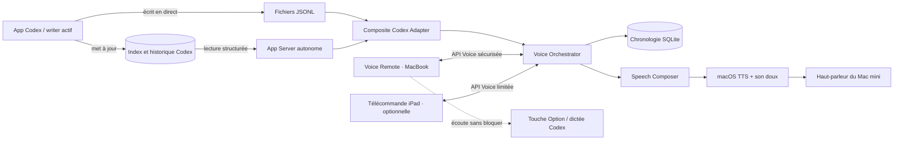

# Codex Voice V3 — options d'architecture et recommandation

## Décision proposée

Construire une architecture distribuée en deux applications :

- **Voice Core** sur le Mac mini observe les tâches Codex, arbitre toutes les prises de parole, conserve la chronologie et produit l'audio avec macOS TTS.
- **Voice Remote** sur le MacBook Pro observe passivement la touche Option et pilote Voice Core avec une connexion persistante à faible latence.
- Une **télécommande iPad légère** pourra ensuite exposer l'état, l'arrêt, le volume et l'activation globale, sans chercher la parité avec le Mac.

Voice Core doit utiliser une **ingestion composite** derrière une interface interne stable : le suivi incrémental des JSONL fournit le flux live des tâches possédées par l'app Codex, tandis qu'un App Server autonome fournit les titres, l'historique structuré et la réconciliation des réponses finales. Si Codex permet ultérieurement à l'app et à Voice Core de partager un même daemon, l'adaptateur App Server pourra prendre en charge le flux live sans modifier le reste du système.

Le protocole Codex ne doit pas être exposé directement aux appareils du réseau : Voice Core publie une petite API dédiée, stable et limitée aux commandes vocales.

Cette option est désignée ci-dessous par **B hybride composite**.

## Pourquoi la V3 ne doit pas être une simple V2 distante

La difficulté centrale n'est plus la synthèse vocale. C'est l'arbitrage entre plusieurs tâches et plusieurs états d'un même message :

- déterminer quelle tâche vient de recevoir l'intervention de l'utilisateur ;
- reconnaître une phrase de progression encore provisoire ;
- attendre la réponse finale qui fait foi ;
- empêcher une tâche parallèle d'interrompre la tâche principale ;
- construire un historique de blocs stable malgré les réécritures ;
- interrompre le Mac mini immédiatement depuis un autre appareil.

Une architecture fondée uniquement sur des fichiers modifiés et des temporisations doit reconstruire toutes ces notions par inférence. L'App Server expose déjà des identifiants de tâche, de tour et de message ainsi que leurs événements de cycle de vie. Dans la topologie actuelle de l'app, un second App Server peut lire ces données persistées mais ne peut pas s'abonner à une tâche qui possède déjà un writer actif. La combinaison des deux sources réduit donc la part d'heuristique sans créer de conflit avec l'app Codex.

## Comparaison des options

| Option | Principe | Atouts | Limites | Verdict |
|---|---|---|---|---|
| **A — V2 distribuée sur JSONL** | Le Mac mini continue à surveiller `~/.codex/sessions`; on lui ajoute une API distante et un client MacBook. | Réutilisation maximale de la V2, prototype rapide, aucune dépendance à un nouveau protocole. | Titres et statuts difficiles à reconstruire, réécritures fragiles, polling, distinction provisoire/final incomplète, chronologie multi-tâches coûteuse en heuristiques. | Bon repli, mauvaise fondation principale. |
| **B — App Server natif** | Voice Core consomme directement les tâches, tours, messages et événements sémantiques de Codex App Server. | Identités stables, titre de tâche, événements de streaming et de fin, lecture d'historique, meilleure base pour le multi-tâches. | Dans la topologie actuelle, l'app possède le writer actif et son App Server n'expose pas de socket partagé ; un second serveur ne peut pas reprendre la tâche active. | Cible future possible, non viable seule aujourd'hui. |
| **B hybride composite — JSONL live + App Server snapshot** | JSONL fournit les nouvelles lignes en temps réel ; App Server liste, nomme, relit et réconcilie périodiquement les tâches. Les deux passent par le même modèle interne. | Fonctionne avec l'app actuelle, conserve la faible latence de la V2, récupère les métadonnées sémantiques, permet une migration future vers un daemon partagé. | Deux sources à corréler et davantage de tests de déduplication. | **Recommandation validée par le spike.** |
| **C — Observation de l'interface du MacBook** | Une app macOS lit l'état visible de Codex via accessibilité ou automatisation et commande l'audio distant. | Connaît potentiellement la tâche affichée et peut essayer de la remettre au premier plan. | Dépend de la structure visuelle de Codex, permissions sensibles, fragile à chaque changement d'UI, ne couvre pas bien l'iPad ni les tâches non visibles. | À réserver à une intégration facultative de navigation. |
| **D — Contrôle uniquement web ou SSH** | Une page ou des commandes ponctuelles pilotent le Mac mini. | Simple pour activer, couper ou régler le volume. | Ne peut pas écouter globalement Option ; une commande SSH par interruption est trop indirecte ; peu adapté à un état temps réel. | Complément possible, pas architecture complète. |

## Architecture cible

### 1. Voice Core sur le Mac mini

Voice Core est l'autorité unique sur l'audio. Il tourne dans la session utilisateur du Mac mini afin d'accéder normalement à la sortie son et comporte six modules.

#### Codex Event Adapter

Il traduit les événements Codex vers un petit modèle interne indépendant du protocole source :

- `userMessageCommitted`
- `assistantCommentaryCompleted`
- `assistantMessageCompleted`
- `turnCompleted`
- `threadTitleChanged`
- `threadStatusChanged`

Trois composants sont prévus :

- `JSONLTranscriptEventSource`, nouveau parseur reprenant de la V2 uniquement les enseignements utiles sur les fichiers partiels, tronqués et les sous-agents ;
- `AppServerSnapshotSource`, chargée des titres, des lectures structurées et de la réconciliation ;
- `AppServerEventSource`, désactivée dans la topologie actuelle mais disponible le jour où un daemon partagé autorisera réellement les abonnements multi-clients.

`CompositeCodexEventSource` corrèle ces données avec `threadId`, `turnId`, `itemId` et les empreintes de contenu. Le reste de l'application ignore complètement quelle source a produit ou confirmé l'événement.

#### Voice Orchestrator

Il contient la machine à états produit, notamment :

- dernière tâche ayant reçu un message utilisateur = tâche principale courante ;
- seuls ses commentaires provisoires peuvent être lus ;
- une tâche parallèle ne peut créer qu'une notification finale courte ;
- une unité audio en cours n'est jamais préemptée par Codex ;
- Option ou Arrêter abandonne immédiatement toute l'unité audio ;
- un lot de notifications abandonné est entièrement consommé, sans reprise ;
- après une lecture principale, le minuteur de calme de dix secondes est relancé ;
- désactiver la voix bloque toute future mise en file ; la réactiver ne rejoue aucun retard.

#### Speech Composer

Il transforme un message final Markdown en blocs visibles et en versions parlées :

- texte narratif court : lecture proche de l'original ;
- paragraphe long : version raccourcie ;
- code, tableau, logs ou chemins : transition orale concise ;
- réponse parallèle : nom court de la tâche et résumé d'une phrase.

Le moteur de résumé doit être une interface distincte. Une première version peut utiliser une extraction déterministe prudente — par exemple la première phrase factuelle nettoyée — puis accueillir un résumé sémantique sans modifier l'orchestrateur.

#### Timeline Store

Une base SQLite locale conserve uniquement l'état nécessaire :

- `threadId`, titre courant et nom parlé ;
- `turnId`, `itemId`, indice du bloc et empreinte du texte source ;
- texte source final, version parlée et type de transformation ;
- état `pending`, `speaking`, `spoken`, `dismissed` ou `silentWhileDisabled` ;
- curseur de navigation global ;
- activation persistante de la voix et volume applicatif.

Une clé `(threadId, turnId, itemId, blockIndex, contentHash)` permet de rejouer les événements sans créer de doublons. Les deltas provisoires ne sont pas inscrits comme blocs durables.

#### Audio Engine

Il reste fondé sur macOS TTS. Le volume de chaque énoncé et du son de notification est piloté par Codex Voice, indépendamment du volume général du Mac mini autant que l'API audio le permet. `stopSpeaking` doit être synchrone du point de vue de l'orchestrateur et prioritaire sur toute autre commande.

#### Notification Scheduler

Il accumule les fins de tâches parallèles, respecte la période de calme et fabrique une seule unité audio :

1. une signature sonore douce ;
2. éventuellement « Trois tâches parallèles ont terminé » ;
3. pour chaque tâche, son nom court et son résumé ;
4. environ deux secondes entre les éléments.

L'unité entière possède un identifiant unique. Une interruption de cet identifiant annule également tous ses éléments non encore lus.

#### Voice Control Server

Il expose uniquement le domaine vocal, jamais les opérations générales de Codex. Les commandes minimales sont :

- `interruptAudio`
- `setVoiceEnabled`
- `setVolume`
- `setMuted`
- `replayBlock`
- `moveHistoryCursor(previous|next)`
- `getState`

Les événements renvoyés aux contrôleurs sont :

- connexion et disponibilité du Mac mini ;
- voix active, inactive ou muette ;
- volume ;
- contenu audio courant et tâche associée ;
- nombre de réponses en attente ;
- curseur et bloc sélectionné.

Chaque commande porte un identifiant client et un numéro de séquence. `interruptAudio` est idempotente et passe devant toute autre commande.

### 2. Voice Remote sur le MacBook Pro

Cette petite app native remplace le menu V2 en tant que surface principale, tout en pilotant le moteur du Mac mini.

Elle :

- écoute le changement d'état de la touche Option sans empêcher Codex de recevoir le même geste ;
- envoie `interruptAudio` dès l'appui, sans attendre que la dictée soit établie ;
- affiche un indicateur discret pendant la lecture avec le nom de la tâche ;
- expose arrêt, activation globale, sourdine, volume et navigation précédent/suivant ;
- montre clairement les états déconnecté, voix inactive et voix active ;
- se reconnecte automatiquement sans réactiver la voix.

L'écoute globale d'Option demandera probablement l'autorisation macOS de surveillance des entrées ou d'accessibilité. Elle doit observer le geste et non le capturer, afin de préserver le push-to-talk natif de Codex.

### 3. Télécommande iPad

La première version iPad peut être une interface web locale ou une petite app dédiée ne proposant que :

- état connecté / voix active ;
- arrêter la lecture ;
- activer ou désactiver la voix ;
- volume et sourdine ;
- éventuellement précédent/suivant.

Une app séparée ne peut vraisemblablement pas observer le toucher du bouton micro à l'intérieur de l'app Codex à cause de l'isolation iPadOS. Le comportement « le micro Codex coupe automatiquement la voix » doit donc rester un spike distinct, dépendant d'un futur événement ou point d'intégration fourni par Codex. L'architecture ne doit pas en dépendre.

## Comment les données Codex répondent au besoin produit

Le format persistant et l'API documentée fournissent ensemble les briques intéressantes :

| Événement ou donnée | Source V3 initiale | Usage V3 |
|---|---|---|
| Identifiants `threadId`, `turnId`, `itemId` | JSONL et App Server | Déduplication, ordre et rattachement d'un bloc à sa tâche. |
| Nom utilisateur de la tâche | `thread/list` App Server | Calcul des trois premiers mots du nom parlé. |
| Élément `commentary` terminé | JSONL incrémental | Lecture précoce éventuelle des phrases provisoires de la seule tâche principale. Le flux observé expose des éléments complets, pas des deltas caractère par caractère. |
| Message agent stabilisé | Snapshot App Server après signal de fin JSONL | État final faisant foi et découpage en blocs. |
| Phase `commentary` ou `final_answer` lorsqu'elle existe | JSONL puis confirmation App Server | Séparation plus fiable entre progression et réponse finale. |
| Fin de tour | JSONL incrémental | Déclenchement d'une réconciliation App Server et de la notification parallèle. |
| Lecture et liste des tâches | App Server | Rattrapage après reconnexion et reconstruction de l'état sans parler du retard. |

Il reste deux précautions :

1. La documentation du schéma précise que tous les fournisseurs ne renseignent pas systématiquement la phase du message. En son absence, l'adaptateur doit attendre `turn/completed`, relire le tour et choisir prudemment le ou les messages finaux.
2. Voice Core ne doit jamais appeler `thread/resume` sur une tâche possédée par l'app. Il utilise `thread/read` ou les méthodes paginées de lecture, déclenchées avec parcimonie après les signaux JSONL. Une lecture complète a dépassé le délai de 45 secondes sur une tâche ancienne pendant le spike ; la production doit donc éviter de rescanner intégralement toutes les tâches.

## Connexion et sécurité

### MVP MacBook ↔ Mac mini

Le chemin le plus simple et le plus sûr pour l'usage actuel est :

- Voice Control Server lié uniquement à `127.0.0.1` sur le Mac mini ;
- tunnel SSH persistant créé par Voice Remote ;
- WebSocket local à travers ce tunnel ;
- reconnexion et keep-alive automatiques.

Cela réutilise l'accès SSH déjà disponible, évite de publier un port sur le Wi-Fi et offre une latence suffisante pour l'interruption.

### Évolution pour l'iPad

Comme l'iPad ne maintiendra pas commodément ce tunnel, une seconde étape pourra ajouter :

- découverte Bonjour ;
- appairage par code à usage unique depuis le MacBook ;
- certificat épinglé ou TLS avec jeton conservé dans le trousseau ;
- permissions strictement limitées à l'API Voice.

L'App Server Codex reste local au Mac mini. Dans la topologie actuelle, Voice Core lance ponctuellement ou maintient son propre processus stdio en lecture et ne tente pas de reprendre le writer de l'app. Il n'est jamais publié directement sur le réseau domestique.

## Capacités à ne pas placer sur le chemin critique

### Amener une tâche au premier plan dans l'app Codex

L'API inspectée sait lire, nommer, reprendre et suivre une tâche, mais n'expose pas clairement une commande « affiche cette tâche dans l'interface graphique Codex ». La navigation audio globale doit donc fonctionner même si l'écran ne change pas automatiquement.

Cette amélioration pourra ensuite être tentée, dans cet ordre :

1. point d'intégration ou lien officiel Codex s'il apparaît ;
2. action proposée à l'utilisateur pour ouvrir la tâche ;
3. petit adaptateur d'accessibilité macOS, isolé et désactivable.

### Détecter le bouton micro de Codex sur iPad

Même principe : c'est une amélioration souhaitable mais non nécessaire au fonctionnement V3. Le contrôle iPad dédié fournit l'arrêt de repli.

### Résumé sémantique parfait

La fiabilité du contrôle, le silence entre tâches et l'interruption ont plus de valeur qu'un résumé sophistiqué. Le système doit savoir annoncer uniquement le nom de la tâche ou une phrase extraite lorsque la confiance du résumé est insuffisante.

## Résultat du spike d'architecture

La sonde sans audio a été exécutée le 31 août 2026 avec `codex-cli 0.149.0-alpha.4.1`. Elle a vérifié cinq points sur de vraies tâches Codex :

1. **Validé** — les tâches de l'app sont listées avec leur titre utilisateur.
2. **Validé pour les tâches inactives** — un serveur autonome peut les reprendre, recevoir leur statut puis se désabonner.
3. **Non disponible pour une tâche active de l'app** — `thread/resume` est refusé avec `already has an active writer`.
4. **Validé** — une deuxième lecture a reconnu 462 messages déjà vus et un seul nouveau message réellement apparu entre les deux snapshots.
5. **Validé sur l'échantillon** — les historiques contenaient 289 messages `commentary` et 84 `final_answer`, sans phase absente dans les deux tâches principales observées.

Une lecture complète d'une troisième tâche ancienne a dépassé le délai de 45 secondes. Ce résultat confirme que la réconciliation devra être ciblée et paginée plutôt qu'effectuée par un balayage intégral régulier.

Le processus App Server possédé par l'app utilise une connexion privée avec celle-ci et aucun socket de daemon partagé n'était présent. La décision est donc actée : JSONL fournit le live dans la V3 initiale ; App Server fournit l'enrichissement et la réconciliation. Le détail reproductible figure dans `APP-SERVER-SPIKE-RESULTS.md`.

## Ordre de réalisation proposé

### Étape 0 — Sonde App Server — terminée

La sonde, ses tests et ses rapports locaux ont validé l'ingestion composite. Les rapports bruts restent dans `.probe/`, ignoré par Git.

### Étape 0.5 — Cœur d'ingestion composite — terminée

Le module Swift `CodexVoiceCore` implémente désormais le modèle d'événements normalisé, le suivi incrémental JSONL, les instantanés App Server ciblés et leur fusion sans double événement de chronologie. Le banc d'essai a validé la combinaison des deux sources sur une tâche réelle. Le détail et les commandes reproductibles figurent dans `INGESTION-CORE.md`.

### Étape 0.75 — Orchestrateur vocal minimal — terminée

`VoiceOrchestrator` choisit la conversation principale à partir du dernier message utilisateur live, au niveau précis du tour. Il laisse silencieux les commentaires parallèles, transforme leur réponse finale en attente après la fin du tour et empêche tout instantané historique ou doublon de provoquer une prise de parole. Les scénarios et les mesures réelles figurent dans `VOICE-ORCHESTRATOR.md`.

### Étape 0.9 — Coordinateur audio local — terminée

Le cœur possède désormais une file non préemptive, une interruption atomique sans reprise, des réglages persistants et un adaptateur macOS TTS. Le runtime local démarre à la fin des journaux avec la voix désactivée sur une nouvelle installation. Le contrat et les validations figurent dans `AUDIO-COORDINATOR.md`.

### Étape 0.95 — Plan de contrôle distant — terminé

Le runtime expose désormais sur `127.0.0.1` un WebSocket versionné et authentifié. Un client macOS de diagnostic pilote interruption, activation, sourdine et volume ; les séquences obsolètes sont absorbées et aucun texte parlé ne traverse l'API. La boucle réelle locale et le refus d'un mauvais jeton ont été validés. Le protocole, le tunnel SSH cible et les commandes reproductibles figurent dans `REMOTE-CONTROL.md`.

### Étape 1 — Boucle push-to-talk distante

- empaqueter le runtime validé comme service Voice Core sur le Mac mini ;
- conserver l'adaptateur composite JSONL live + App Server snapshot déjà validé ;
- transformer le client de diagnostic en app Voice Remote sur le MacBook ;
- automatiser le tunnel SSH persistant ;
- lecture macOS TTS de la tâche principale ;
- Option coupe immédiatement ;
- exposer dans l'app l'activation persistante, la sourdine et le volume distant déjà disponibles dans l'API.

Cette étape doit déjà restaurer le bénéfice essentiel de la V2 dans le nouvel environnement.

### Étape 2 — Multi-tâches calme

- distinction principale / parallèle ;
- aucune préemption entre tâches ;
- notifications finales, son doux, délai de dix secondes et lots annulables ;
- titre parlé de trois mots.

### Étape 3 — Blocs et chronologie

- parseur Markdown et blocs finaux stables ;
- navigation précédent/suivant dans et entre les tâches ;
- déduplication du provisoire et du final ;
- versions parlées adaptées aux blocs techniques.

### Étape 4 — Surfaces secondaires

- télécommande iPad légère ;
- appairage réseau local sécurisé ;
- expérimentation de l'ouverture de tâche dans Codex ;
- expérimentation du geste micro iPad si un point d'intégration devient disponible.

## Décisions techniques initiales

- **Langage** : Swift pour Voice Core et Voice Remote, afin de réutiliser la V2 et les API macOS natives.
- **Audio** : macOS TTS comme moteur de référence ; Voxtral devient au mieux un plug-in ultérieur.
- **Persistance** : SQLite local sur le Mac mini.
- **Transport V3** : protocole Codable étroit sur WebSocket ; SSH pour le MVP MacBook.
- **Ingestion Codex** : JSONL incrémental pour le live ; App Server local pour les snapshots, titres et réconciliations ; interface commune encapsulée.
- **Autorité** : seul Voice Core décide de parler, d'attendre ou d'abandonner.
- **Arriéré** : jamais lu automatiquement après reconnexion ou réactivation.

## Sources et état de maturité

La documentation officielle présente Codex App Server comme l'interface destinée à intégrer Codex à un produit. Elle documente les tâches, les tours, les événements de messages, l'élément terminé comme état faisant foi et la génération de schémas propre à chaque version. Elle précise aussi que le transport WebSocket est expérimental et ne doit pas être exposé sans authentification ; `ws://` est réservé au localhost ou à un tunnel SSH. Voir [Codex App Server](https://learn.chatgpt.com/docs/app-server).

L'inspection locale a été réalisée avec `codex-cli 0.149.0-alpha.4.1`. Le schéma de cette version définit les phases `commentary` et `final_answer`, tout en avertissant que la phase peut être absente selon le fournisseur. Le code doit donc tolérer les champs inconnus, versionner ses fixtures d'événements et ne jamais dépendre d'une phase présente à 100 %.
