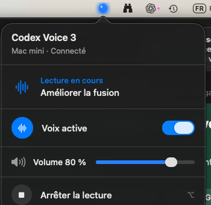

# Codex Voice 3

**Push-to-talk for Codex when the work runs on another Mac.**

Codex Voice 3 turns a headless Mac mini into the voice side of a Codex session while a MacBook remains the control surface. Codex speaks through macOS text-to-speech; pressing Option on the MacBook immediately stops the remote audio so the user can talk again.

<p align="center">
  
</p>

This is an independent open-source project and is not affiliated with or endorsed by OpenAI.

## Why this exists

The first versions worked well while Codex, speech and keyboard input all lived on one Mac. That model broke down when development moved to a screenless Mac mini controlled from a MacBook or iPad:

- the push-to-talk key no longer stopped speech on the remote computer;
- volume and voice state were difficult to reach;
- parallel Codex tasks could start speaking over the task currently being discussed.

V3 is a clean Swift rewrite shaped by several months of daily use. Its product rule is deliberately simple: **the user may interrupt the voice, but one Codex task may never interrupt another.**

## Available in v0.1

- Native macOS menu-bar controller with a compact blue halo.
- Global, passive Option-key observation for immediate remote interruption.
- Voice on/off, app-level volume and stop controls.
- Live authenticated state over a persistent WebSocket connection.
- Localhost-only control service designed to travel through an SSH tunnel.
- macOS `AVSpeechSynthesizer` output on the Mac that runs Codex.
- Multi-task ingestion, deduplication and main-conversation selection.
- Non-preemptive audio queue: another Codex task cannot cut in.
- Persistent safe defaults: a new installation starts silent and re-enabling voice never replays an old backlog.
- A user LaunchAgent installer for the headless Mac; no administrator account required.

The first public release is an Apple Silicon developer preview for macOS 13 or later. It is ad-hoc signed, not Developer ID signed or notarized.

## Architecture

Codex Voice is split into two small applications:

1. **Voice Local** runs beside Codex on the Mac mini. It follows Codex session data, decides what is eligible to speak, owns the audio queue and exposes a narrowly scoped control API on `127.0.0.1`.
2. **Voice Remote** lives in the MacBook menu bar. It reaches that API through SSH, displays the live state and turns Option into a universal “I am speaking now” command.

The controller never receives the text being read. Remote state contains only operational metadata such as voice state, volume, task title, reading kind and queue counts. The Codex App Server is never exposed on the network.

## Install

### 1. Install Voice Local on the Mac mini

Xcode Command Line Tools or Xcode are required.

```shell
git clone https://github.com/defrenne-lab/codex-voice.git
cd codex-voice
Scripts/install-local-service.sh
```

The installer builds a release binary, puts it in `~/Library/Application Support/Codex Voice 3`, and registers `lab.defrenne.codexvoice3.local` as a user LaunchAgent. The service starts automatically at login and remains silent until voice is explicitly enabled.

Verify it with:

```shell
launchctl print "gui/$(id -u)/lab.defrenne.codexvoice3.local"
```

### 2. Install Voice Remote on the MacBook

Download `Codex-Voice-3-macOS.zip` from the [latest release](https://github.com/defrenne-lab/codex-voice/releases/latest), expand it, and move **Codex Voice 3.app** to `~/Applications` or `/Applications`.

Copy the private control token once, replacing the placeholders with the SSH account and hostname of the Mac mini:

```shell
install -d -m 700 ~/.codex-voice
scp <mini-user>@<mini-host>:~/.codex-voice/control-token ~/.codex-voice/control-token
chmod 600 ~/.codex-voice/control-token
```

Keep this SSH tunnel open during the session:

```shell
ssh -N -L 48731:127.0.0.1:48731 <mini-user>@<mini-host>
```

Then launch **Codex Voice 3**. On first use, macOS may request Input Monitoring permission. The app observes Option without consuming or modifying the event, so Codex still receives its normal push-to-talk shortcut.

Because v0.1 is not notarized, macOS may ask you to confirm the first launch through Finder. Always verify that the archive came from this repository and compare its published SHA-256 checksum before opening it.

## Using it

- Left-click the halo to open controls.
- Press Option while audio is playing to abandon the current reading and its queued fragments.
- Switch **Voix active** off before leaving long-running overnight tasks.
- Adjust the voice volume independently of the Mac mini's physical controls.
- Right-click the halo to quit the MacBook controller.

An interruption is not a pause: speech never resumes automatically. The full answer remains visible in Codex.

## Build and test

```shell
swift test
Scripts/build-remote-app.sh
Scripts/package-remote-app.sh
```

The package script creates `.build/Codex-Voice-3-macOS.zip` and a matching SHA-256 file. The project currently has 41 automated tests around ingestion, ordering, orchestration, audio coordination, authentication, deduplication and token permissions.

## Security model

- The control server binds only to `127.0.0.1`.
- Plain WebSockets are accepted only for localhost; non-local endpoints must use TLS.
- A random 256-bit bearer token is created locally with `0700` directory and `0600` file permissions.
- The token, transcripts and diagnostic state are never part of the release archive.
- The remote API controls voice only; it does not expose arbitrary Codex operations.

See [SECURITY.md](SECURITY.md) and [REMOTE-CONTROL.md](REMOTE-CONTROL.md) for the protocol and threat boundaries.

## Next

The foundations intentionally come before the richer experience. Planned work includes:

- short, calm summaries when parallel tasks finish;
- a global history of readable answer blocks and explicit replay;
- spoken-text adaptation for long or code-heavy paragraphs;
- easier tunnel lifecycle and device pairing;
- a lightweight iPad control surface.

The design rationale lives in [PRODUCT-BRIEF-V3.md](PRODUCT-BRIEF-V3.md). Architecture probes and validated trade-offs are kept in the repository so the project remains understandable rather than becoming a black box.

## License

[MIT](LICENSE) © 2026 Sébastien Defrenne.
